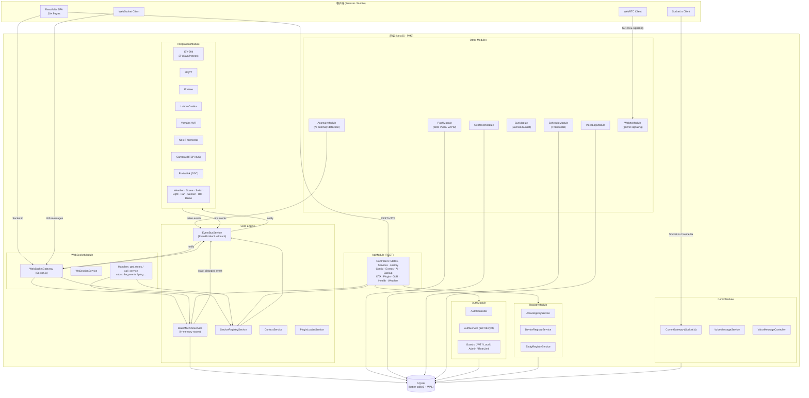
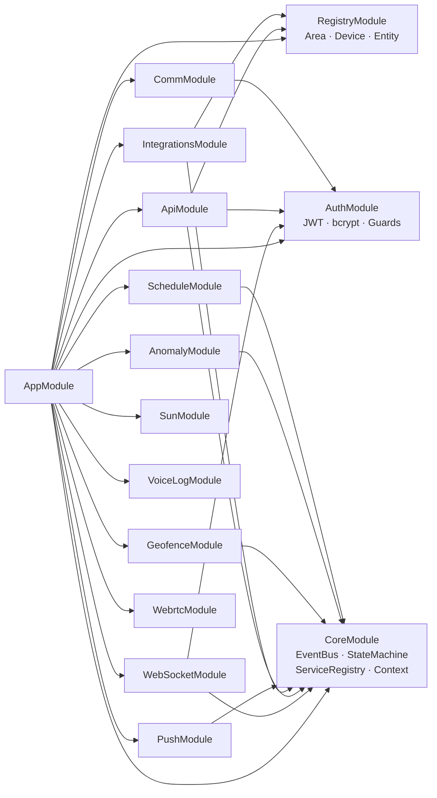
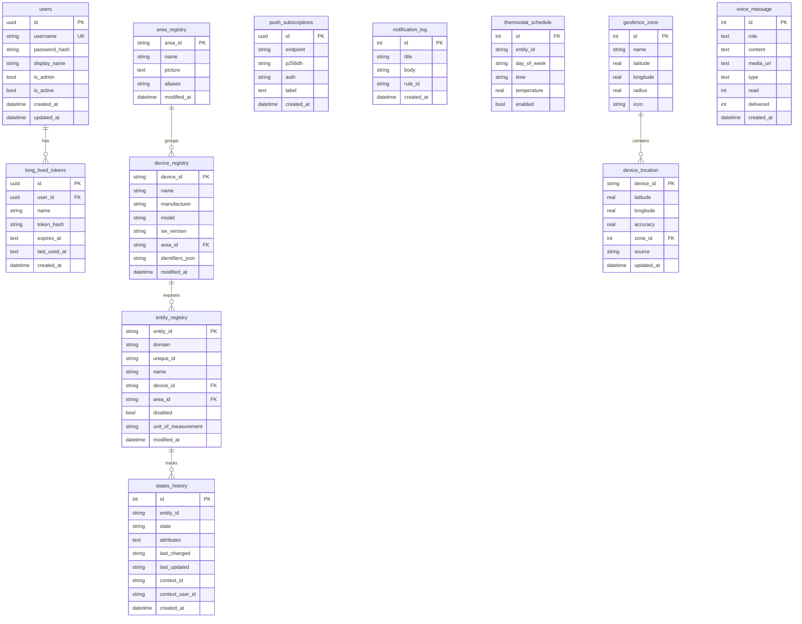
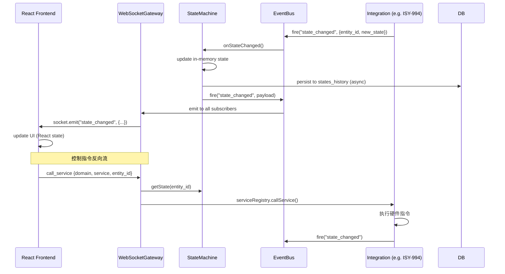

# Home Assistant — UML 架构图

## 1. 系统整体架构（Component Diagram）

---

## 2. 后端模块依赖图（Module Dependency）

---

## 3. 数据库实体关系图（ER Diagram）

---

## 4. 前端页面结构（Frontend Page Map）

```mermaid
graph TD
    APP["App.tsx<br/>(React Router + AuthContext)"]

    APP --> LOGIN[LoginPage]
    APP --> AUTH_LAYOUT["AuthLayout (需登录)"]

    AUTH_LAYOUT --> DASH[DashboardPage<br/>状态卡片 + 快捷控制]
    AUTH_LAYOUT --> FP2D[FloorPlan2DPage<br/>SVG 平面图]
    AUTH_LAYOUT --> FP3D[FloorPlanPage<br/>Three.js 3D场景]
    AUTH_LAYOUT --> ENTITIES[EntitiesPage<br/>实体列表]
    AUTH_LAYOUT --> AUTO[AutomationsPage<br/>自动化规则]
    AUTH_LAYOUT --> SCENES[ScenesPage<br/>场景/脚本]
    AUTH_LAYOUT --> THERMO[ThermostatPage<br/>温控 + 周计划]
    AUTH_LAYOUT --> ENERGY[EnergyPage<br/>能耗SVG图表]
    AUTH_LAYOUT --> CAMERAS[CameraGridPage<br/>HLS多路流]
    AUTH_LAYOUT --> HISTORY[HistoryPage<br/>状态历史]
    AUTH_LAYOUT --> EVENTS[EventsPage<br/>事件总线日志]
    AUTH_LAYOUT --> SEC[SecurityPage<br/>Envisalink防盗]
    AUTH_LAYOUT --> GEO[GeofencePage<br/>地理围栏/地图]
    AUTH_LAYOUT --> NOTIF[NotificationsPage<br/>Push通知规则]
    AUTH_LAYOUT --> INTEGR[IntegrationsPage<br/>集成管理]
    AUTH_LAYOUT --> SETTINGS[SettingsPage<br/>系统健康/配置]
    AUTH_LAYOUT --> OTA[OtaPage<br/>固件升级]
    AUTH_LAYOUT --> BACKUP[BackupPage<br/>备份/恢复]
    AUTH_LAYOUT --> AREAS[AreasPage]
    AUTH_LAYOUT --> PERSONS[PersonsPage]
    AUTH_LAYOUT --> RTI[RtiPanelPage<br/>RTI控制面板]

    AUTH_LAYOUT --> PANEL["Panel (常驻浮层)"]
    PANEL --> AICHAT[AiChatPanel<br/>AI对话 + 语音]
    PANEL --> DOORBELL[DoorbellOverlay<br/>门铃呼叫]
    PANEL --> EDITPANEL[EditPanel<br/>实体编辑]

    subgraph "全局组件"
        TABBAR[TabBar 12项导航]
        SHORTCUT[ShortcutBar 快捷键]
        SYSSTAT[SystemStats CPU/RAM/Disk]
    end
```

---

## 5. 实时通信流（Sequence Diagram）

---

## 图示说明

| 层级 | 技术 | 职责 |
|------|------|------|
| Frontend | React + Vite + Socket.io | 20+ 页面，实时状态订阅 |
| API Layer | NestJS REST + WebSocket | 状态查询、服务调用、认证 |
| Core Engine | EventBus + StateMachine | 事件驱动，状态中心存储 |
| Integrations | 13+ 设备驱动 | 设备协议适配（MQTT/TCP/HTTP） |
| Database | SQLite (WAL mode) | 状态历史、用户、注册表 |
| Real-time | Socket.io + WebRTC | 聊天、门铃呼叫、摄像头流 |
